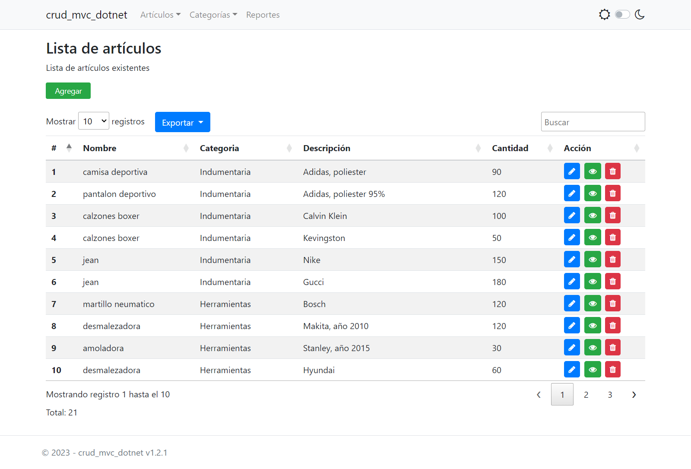
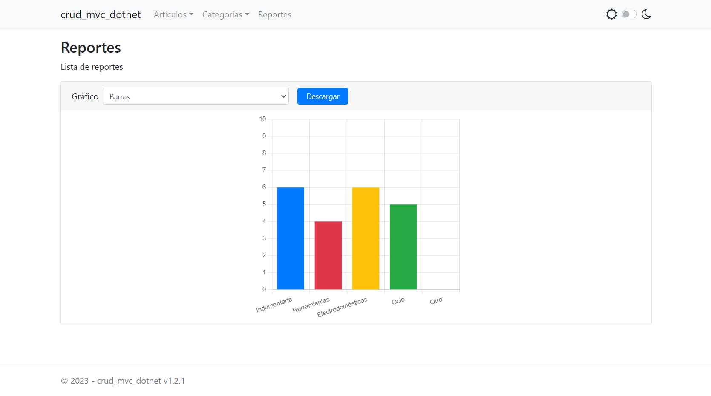
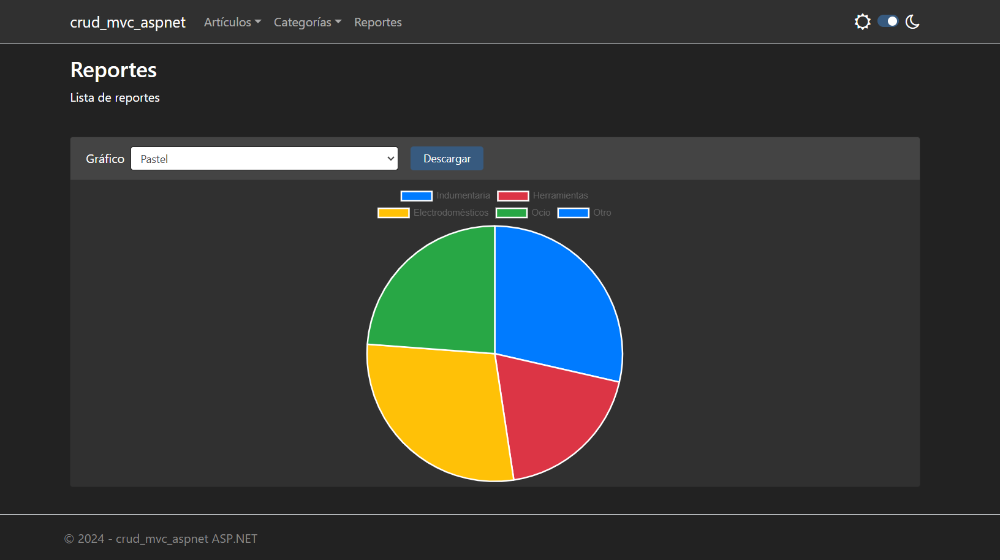

# Crud MVC ASP\.NET Framework

Sistema básico tipo CRUD hecho en MVC ASP.NET Framework 4.5 con base
de datos LocalDB

## ¿De qué trata esta aplicación?

Este proyecto consiste en un pequeño sistema de inventario con una base de datos 
lista para usar y lógica de negocio mínima. 
Todos los componentes usados en mayor o menor medida se listan a continuación

  Backend
  - [Entity Framework 6.0](https://www.nuget.org/packages/EntityFramework/6.0.0)

  Frontend
  - [Bootstrap 4.3.1](#https://getbootstrap.com/)
  - [Bootswatch 4.6.2](#https://bootswatch.com/) (tema nocturno)
  - [DataTables 1.13.3](https://datatables.net/)
  - [JQuery 3.5.1](#https://jquery.com/)
  - [ChartJS](#https://www.chartjs.org/) (gráficos)

## ¿Cómo pruebo esto? - despliegue con IIS en Windows (guía rápida)

Para poder ejecutar la aplicación en un sistema Windows usando 
Internet Information Services (IIS) se necesita tener instalado 
los siguientes componentes.

  - [SQL Server Express LocalDB](https://learn.microsoft.com/en-us/sql/database-engine/configure-windows/sql-server-express-localdb?view=sql-server-ver16)
  - Internet Information Services 10 (desactivado por defecto en Windows)
  - [.Net Framewort 4.5 runtime](https://www.microsoft.com/es-ar/download/details.aspx?id=30653)

Una vez hecho esto seguir los siguientes pasos:

1. Crear un directorio en la ruta `C:\inetpub\wwwroot\`, por ej. 
`C:\inetpub\wwwroot\misitio`.

2. En IIS ir a → **Conexiones** → **Sitios** → **Agregar sitio web...** → 
y ahí completamos los siguientes campos:
    - **Nombre de sitio**: cualquier valor
    - **Grupo de aplicaciones**: cualquier valor
    - **Ruta de acceso física**: aquí copiamos la ruta creada en el paso 1 
sería esta `C:\inetpub\wwwroot\misitio`
    - **Puerto**: elegimos un puerto que no este en uso.

3. Desplegamos la aplicación mediante FTP desde Visual Studio IDE
en la carpeta `C:\inetpub\wwwroot\misitio`.

4. En la carpeta `C:\inetpub\wwwroot\misitio` bsucamos el archivo `Web.config` y 
lo editamos para que apunte a la base de datos (archivo .mdf) que se encuentra 
en la carpeta `App_Data`. Dejamos la sección `connectionStrings` en el 
`Web.config` como se ve a continuación:

    ```xml
    <connectionStrings>
      <!--develop-->
      <!-- <add name="DefaultConnection" connectionString="Server=(LocalDB)\MSSQLLocalDB; Database=crud_mvc_aspnet; Trusted_Connection=True;" providerName="System.Data.SqlClient" /> -->
      <!--deploy in any machine-->
      <add name="DefaultConnection" connectionString="Data Source=(LocalDB)\MSSQLLocalDB; AttachDbFilename=|DataDirectory|\crud_mvc_aspnet.mdf; Trusted_Connection=True;" providerName="System.Data.SqlClient"/>
    </connectionStrings>
    ```

5. En IIS ir a → **Acciones** → **Sitios** (elegimos el que creamos) 
→ **Examinar \*:<puerto> (http)** y le damos click, se nos abrira el sitio con 
  la aplicación ya desplegada.

**NOTA: Para ver un paso a paso más detallado acerca de como desplegar una aplicación
usando IIS ver [este enlace](https://github.com/manuel-chinchi/notes-dev)**

## Plataformas soportadas

Windows 7 en adelante

## Arquitectura de la aplicación

La aplicación cuenta con una estructura tipo MVC (Modelo-Vista-Controlador). Además implementa 
una capa de servicios para el acceso a datos. **Todo esto en un mismo proyecto**. 
Para una vista general, se presenta el diagrama de clases (archivo `ClassDiagram.cd`)


## Capturas

Lista de artículos

<p align="center">
  
</p>

Reportes

<p align="center">
  
</p>

**Modo nocturno**

Lista de artículos

<p align="center">
  
</p>

Gráficos

<p align="center">
  
</p>

<!--## Demostración-->

<!-- https://user-images.githubusercontent.com/88981972/233879807-b1d2f422-6fdb-4d00-b366-6c6c44391dc6.mp4 -->


## Referencias

https://dvoituron.com/naming-conventions/rules/
