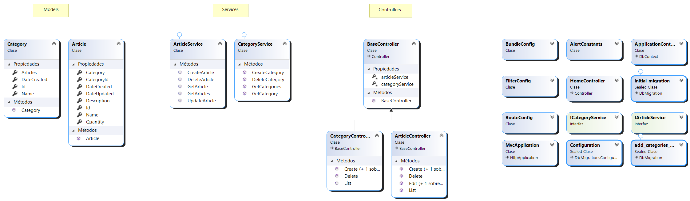
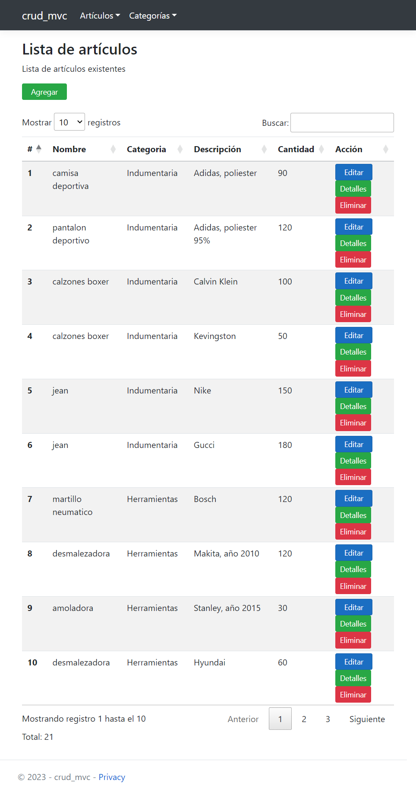
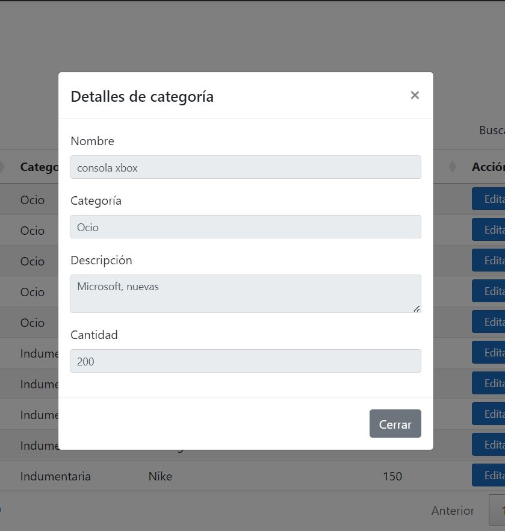

# Crud MVC Aspnet

 Sistema básico con operaciones CRUD hecho en MVC ASP.Net 4.5 y Entity Framework listo 
 para ejecutarse.

## ¿De qué trata esta aplicación?

Este proyecto consiste en un pequeño sistema de inventario con una base de datos 
lista para usar y lógica de negocio mínima. 
Todos los componentes usados en mayor o menor medida se listan a continuación

  - [Entity Framework 6.0](https://www.nuget.org/packages/EntityFramework/6.0.0) (back-end)
  - [datatables 1.13.3](https://datatables.net/) (front-end)

## ¿Cómo pruebo esto? (Despliegue)

Para poder ejecutar la aplicación se necesita tener previamente instalado los siquientes 
programas

  - [SQL Server Express LocalDB](https://learn.microsoft.com/en-us/sql/database-engine/configure-windows/sql-server-express-localdb?view=sql-server-ver16)
  - Internet Information Services 10 (IIS)
  - [.Net Framewort 4.5 runtime](https://www.microsoft.com/es-ar/download/details.aspx?id=30653)

Una vez instalados, seguir los siguientes pasos para iniciar el proyecto.

  1. Crear un directorio con los archivos de la aplicación en `C:\inetpub\wwwroot\mi-sitio`.

  2. Abrir Internet Information Services (IIS), "Conexiones" > "Agregar sitio web..."
  
  3. Completar los campos "Nombre del sitio" y "Grupo de aplicaciones" (se completan automáticamente a la vez)
  luego en "Ruta de acceso física" indicar la ruta de los archivos del sitio. Sería en
  este caso `C:\inetpub\wwwroot\mi-sitio` y elegir un puerto que no este asignado. Darle 
  despues a "Aceptar".
  
  5. Antes de iniciar el proyecto cambiar la conexión para que "apunte" a la base de datos
  que esta dentro de la carpeta `App_Data`. Para esto, modificar el archivo `Web.config`
  y cambiar la cadena de conexión así.
      ```xml
      <connectionStrings>
        <!--develop-->
        <!-- <add name="DefaultConnection" connectionString="Server=(LocalDB)\MSSQLLocalDB; Database=crud_mvc_aspnet; Trusted_Connection=True;" providerName="System.Data.SqlClient" /> -->
        <!--deploy in any machine-->
        <add name="DefaultConnection" connectionString="Data Source=(LocalDB)\MSSQLLocalDB; AttachDbFilename=|DataDirectory|\crud_mvc_aspnet.mdf; Trusted_Connection=True;" providerName="System.Data.SqlClient"/>
      </connectionStrings>

      ```
      Asegurarse de que el apartado `connectionStrings` quede como se muestra arriba.

  4. Luego, en IIS seleccionar el sitio y en "Acciones" > "Examinar \*:8x (http)" para abrir el sitio.
  
      **NOTA: Sí sale algún error al querer ejecutar la aplicación, revisar este documento 
      general para desplegar aplicaciones (paso a paso) que usan LocalDB en IIS 
      desde [este enlace](Resources/Deploy/Readme.md).**

## Arquitectura de la aplicación

La aplicación cuenta con una estructura tipo MVC (Modelo-Vista-Controlador). Además implementa 
una capa de servicios para el acceso a datos. **Todo esto en un mismo proyecto**. 
Para una vista general, se presenta el diagrama de clases (archivo `ClassDiagram.cd`)



## Capturas

Pagina de lista de artículos.

<p align="center">
  
</p>

Página de detalles de un artículo.

<p align="center">
  
</p>

## Demostración

https://user-images.githubusercontent.com/88981972/233879807-b1d2f422-6fdb-4d00-b366-6c6c44391dc6.mp4
 